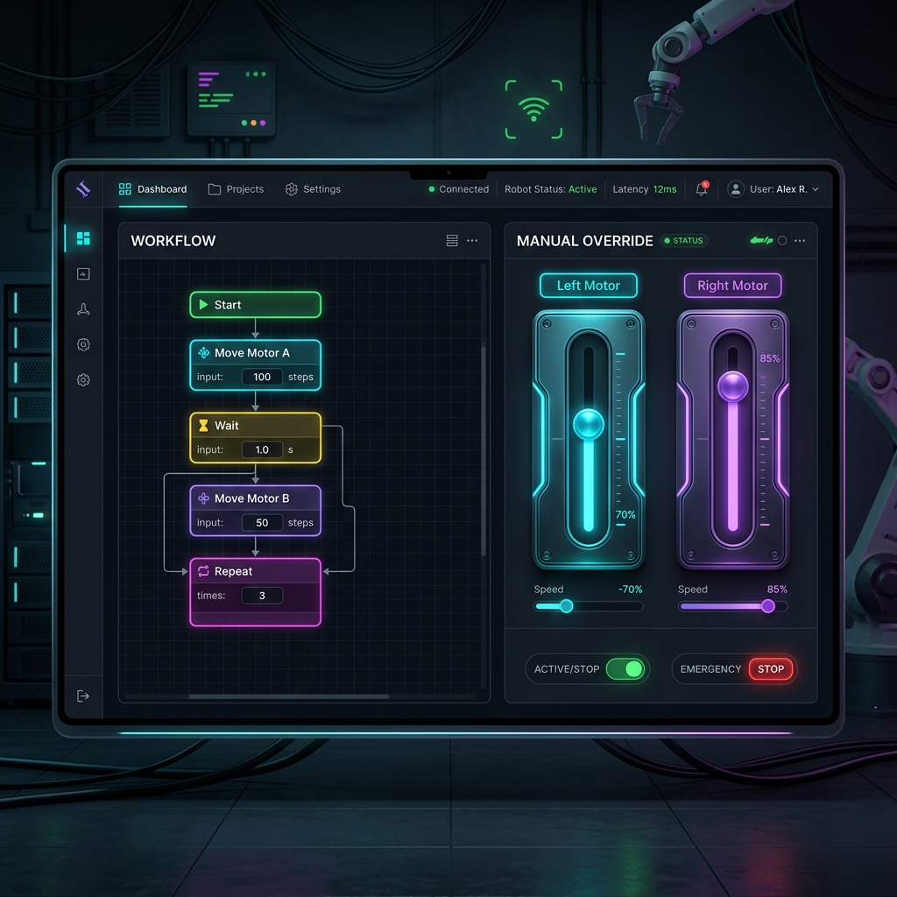

# ESP32-S2 Mini Robot Controller: Visual Kinematics Machine Learning & Remote Robot Pet Mode

This is an educational MicroPython project for the **ESP32-S2 Mini** board designed to control **28BYJ-48 stepper motors** via **ULN2003 driver boards**. 

It runs a fully self-contained Access Point (AP) with a **Captive Portal** DNS server. Any browser connecting to it will automatically redirect to a modern web-based control dashboard.

---

## 🖥️ Web User Interface in Action

Here is the control dashboard showing the visual block programming workspace, real-time camera tracking, Neural Network kinematics learning console, and dual vertical joystick overrides:



### Key UI Features:
1.  **🧩 Workflow Creator (Left Panel):** Drag-and-drop programming blocks with speed controls and custom conditional blocks based on camera vision tracking.
2.  **📷 Vision Sensor Color Tracker (Right Panel - Top):** Real-time client-side color blob centroid tracker with click-to-pick color selection.
3.  **🧠 Neural Network Learning Mode (Right Panel - Middle):** Self-calibrating gradient descent routine that learns motor kinematics on-the-fly to enable autonomous target following.
4.  **🐾 Robot Pet Mode (Split-Screen Overlay):** Split-screen dashboard containing the remote camera feed on the left and animated expressive eyes with a green terminal log on the right.
5.  **🕹️ Manual Joystick Override (Right Panel - Bottom):** Throttled dual vertical joysticks with spring-back stop capabilities.

---

## 🐾 Interactive Robot Pet Mode (Stationary Camera Setup)

Instead of mounting the phone on the robot, **the phone sits stationary on a stand (tripod) watching the robot's workspace.** The robot has a colored tracker marker on its active element, and the phone acts as the robot's **remote visual eyes**. 

Click **🐾 LAUNCH PET FACE** in the top header to enter **Robot Pet Mode**. The browser UI splits into a visual workspace panel on the left (showing what the camera sees) and the animated robot face with its console logs on the right.

### 1. Self-Learning Kinematics (Discovery Phase)
Before starting, run the **Neural Network Training** calibration:
1.  **Step 1: Scan and Register the Robot:**
    *   Click **Start Training** to activate the scanner wizard.
    *   The console will prompt: *"STEP 1: SCAN THE ROBOT! Click directly on the robot's colored tracking marker in the camera view above."*
    *   Clicking on the marker registers its color. The system locks onto the centroid and verifies the scan: *"Robot scanned successfully! Centroid locked at (X, Y)."*
2.  **Step 2: Kinematic Calibration (Babbling):**
    *   Once scanned, the system automatically triggers a 3-second countdown and begins the calibration run.
    *   The robot automatically wiggles its motors back and forth (babble phase).
    *   The stationary camera measures how moving each motor changes the marker's $(X, Y)$ coordinate in the video feed.
3.  **Step 3: Neural Net Convergence:**
    *   A client-side neural network trains on these coordinates to **discover the robot's mechanical structure** (whether it's a 2-wheel rover, a robotic arm, a gantry, or a pivot turret). It learns the exact weights needed to map a desired visual path $(\Delta X, \Delta Y)$ to motor inputs.
    *   The mathematical formulas learned by the network are output in real-time.

### 2. Interactive Play (Virtual Candy Treats 🍬)
*   Tap anywhere on the live video feed inside the Pet Mode panel to place a **Virtual Candy Target**.
*   A neon-green circle appears on screen. The robot calculates its current displacement to the treat, plans a visual path, and uses its **trained Neural Network** to navigate its marker to the treat.
*   Once it arrives (within 20 pixels), it "eats" the treat, logs it, and wiggles in a happy dance before returning to exploration!

### 3. Autonomous Wandering (Curiosity & Exploring)
*   When there are no active treats, the robot goes into **Exploring State**.
*   It picks random $(X, Y)$ coordinates inside the camera's view, draws a dotted search target on the screen, and navigates to them using its neural network.
*   Upon arrival, it pauses, does a little wiggle, and picks another random coordinate to wander towards.

### 4. Microphone Clap wakeups & Optical Blockage detection
*   **Clap Wakeup:** If the robot is sleeping (eyes closed), you can clap in front of the phone's microphone to wake it up. If active, clapping makes it do an excited spin!
*   **Collision Detection:** If the robot is explore-driving but the camera scene remains static (calculated using frame-to-frame pixel differencing), the system realizes the robot is blocked by an obstacle. It turns angry (red eyes), stops, backs up, spins to clear the path, and continues exploring.

---

## ⚡ Powering the Robot via the ESP32-S2 Mini's 5V Pin

Yes! You can power both the ESP32-S2 Mini and the stepper motors from the **same USB power bank** using the board's **onboard 5V pin**. 

The **5V pin** on the ESP32-S2 Mini is directly connected to the USB-C port's `VBUS` power line. When you plug a USB power bank into the board's USB-C port, the 5V pin becomes a 5V power output. This is the simplest and cleanest wiring method because **you don't need to cut any USB cables or use breakout boards**—you just plug a standard USB-C cable into the board and use standard jumper wires!

### ⚠️ Important Engineering Rules to Prevent Resets (Brownouts)
When the stepper motors rotate, they draw pulsed current spikes. This can create voltage sags on the 5V rail that cause the ESP32 to reboot. To make this setup 100% stable:
1.  **Use a Decoupling Capacitor:** You **must** connect a **470uF or 1000uF Electrolytic Capacitor** (rated 10V+) directly across the VCC and GND terminals of the ULN2003 drivers. This capacitor acts as a buffer to absorb motor spikes and keep the ESP32's voltage rails stable.
2.  **Use a Dedicated USB Power Bank:** Plug the USB-C cable into a dedicated portable phone charger/power bank (which easily outputs 1.5A to 2.0A). Avoid powering the robot from a computer's laptop USB port, as computers limit USB current to 500mA, which will trigger resets.

### 🔌 Electrical Wiring Diagram
```
                     +---------------------------------------+
                     |         USB-C POWER BANK (2A)         |
                     +---------------------------------------+
                                         |
                                         v  (Standard USB-C Cable)
                     +---------------------------------------+
                     |          ESP32-S2 MINI BOARD          |
                     |                                       |
                     | GP1  GP2  GP3  GP4   GP5  GP7  GP9  GP11|
                     +--+----+----+----+-----+----+----+----+--+
                        |    |    |    |     |    |    |    |
                        |    |    |    |     |    |    |    |
                        |    |    |    |     |    |    |    |
     +------------------+    |    |    |     |    |    |    |
     |  +--------------------+    |    |     |    |    |    |
     |  |  +----------------------+    |     |    |    |    |
     |  |  |  +------------------------+     |    |    |    |
     |  |  |  |                              |    |    |    |
     |  |  |  |      +-----------------------+    |    |    |
     |  |  |  |      |  +-------------------------+    |    |
     |  |  |  |      |  |  +---------------------------+    |
     |  |  |  |      |  |  |  +-----------------------------+
     |  |  |  |      |  |  |  |
  +--+--+--+--+--+   +--+--+--+--+--+
  | IN1 IN2 IN3 IN4  |   | IN1 IN2 IN3 IN4  |
  |                  |   |                  |
  |  DRIVER BOARD A  |   |  DRIVER BOARD B  |
  |  (LEFT MOTOR A)  |   | (RIGHT MOTOR B)  |
  |  VCC        GND  |   |  VCC        GND  |
  +---+----------+---+   +---+----------+---+
      |          |           |          |
      |          |           |          |
      |          +-----------|----------+-------> to ESP32-S2 "GND" Pin
      |                      |
      +----------------------+------------------> to ESP32-S2 "5V" Pin
                 |           |
                 |   +-------+-------+
                 |   |  Capacitor:   |
                 |   |  1000uF, 10V  |
                 |   |  (+)     (-)  |
                 +---+--(+)     (-)--+
```

### 3. Step-by-Step Wiring Connections
1.  **Microcontroller Power:** Plug a standard USB-C cable from your USB power bank into the ESP32-S2 Mini's USB port.
2.  **Motor Driver Power:** 
    *   Connect the **5V pin** of the ESP32-S2 Mini to the **VCC** (+) pin of both ULN2003 driver boards.
    *   Connect the **GND pin** of the ESP32-S2 Mini to the **GND** (-) pin of both ULN2003 driver boards.
3.  **Capacitor Buffer:** Connect the capacitor in parallel with the driver power:
    *   Connect the longer positive lead (+) of the capacitor to the driver **VCC** (+) rail.
    *   Connect the shorter negative lead (-) of the capacitor to the driver **GND** (-) rail.
4.  **Control Lines:**
    *   Connect Motor A IN1-IN4 to ESP32 **GPIO 1, 2, 3, 4**.
    *   Connect Motor B IN1-IN4 to ESP32 **GPIO 5, 7, 9, 11**.

---

## 🚀 How to Flash and Run

All uploading, configuration, and flashing tasks are simplified via the included [Makefile](Makefile).

### 1. Install CLI Tools
Install the necessary python command-line tools (`mpremote` and `esptool`):
```bash
make install-tools
```

### 2. Upload Code to ESP32
Connect your board to your computer and upload all files (defaults to serial port `/dev/ttyACM0`):
```bash
make upload
```

### 3. Reset the Board
Run the following command to reboot the board and launch the program:
```bash
make reset
```
*(If your port is different, e.g. COM3 or /dev/ttyUSB0, append `PORT=COM3` to make commands).*
