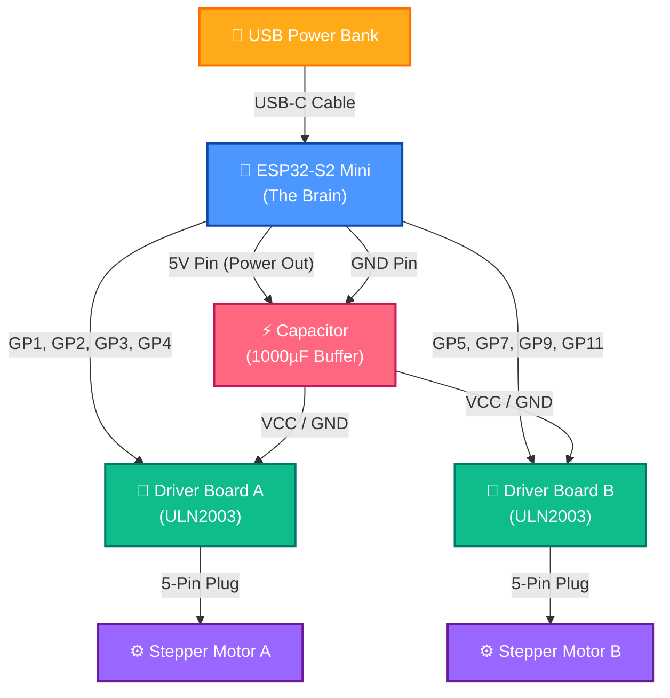

# 🤖 ESP32-S2 Mini Kinetic Builder Dashboard

Welcome to the **Kinetic Builder Dashboard**! This is a fun, visual way to build and program **anything you can imagine** using an **ESP32-S2 Mini** brain and motorized stepper muscles. 

It doesn't have to be a standard robot—you can build a **crane**, a **car**, a **catapult**, a **drawing machine**, a **conveyor belt**, or a **robotic arm**! As long as it uses the motors and sensors, you can bring it to life.

The brain board acts as its own Wi-Fi hotspot. When you connect your phone, tablet, or computer to it, this modern dashboard pops up automatically—no internet needed!

---

## 🎨 The Three Awesome Modes

The dashboard splits the control into three visual modes. Tap the tabs at the top of the screen to switch between them:

### 🧩 1. Coding Mode (Workflow Creator)
This is your coding workspace! Click block buttons on the left to add command blocks. Drag them around to change their order, choose which motors to run, adjust speeds, and add wait times. 

**Senses & Command Blocks:**
*   **Set Motor Speed:** Adjust the speed delay of any motor on-the-fly.
*   **Stop Motors:** Instantly freeze all movement.
*   **If Vision tracks target:** Run blocks only if the camera sees your tracking marker in a certain area (Left, Center, Right).
*   **If Sound hears clap:** Run blocks only when the phone microphone detects a loud clap!

---

### 🕹️ 2. Manual Drive Mode (Steering Joysticks)
Drive your creation directly using virtual vertical joysticks! Slide them up or down to rotate cogs, move joints, or drive wheels, and release them to stop. The dashboard automatically builds a joystick for every motor you connect.

---

### 🧠 3. AI Explorer Mode (Kinematic Discovery)
This is where the magic happens! Your creation doesn't need to know what it is. In this mode, the phone watches the creation from a stand and **helps it discover its own body** (whether it's a crane, a car, or a catapult).

1.  **Scan the Sticker:** Put a bright colored sticker on the moving part of your build. Click **Start Training** and tap that sticker on your phone screen to lock the target.
2.  **Kinematic Babbling:** The creation automatically wiggles its motors. The camera measures how each wiggle moves the sticker on the screen.
3.  **Self-Discovery:** 
    *   *"Oh, I am a crane! Turning Motor A lifts my arm up!"*
    *   *"Oh, I am a car! Turning Motor A drives me forward, and Motor B steers me!"*
    *   *"Oh, I am a catapult! Motor A winds up my spring cog!"*
4.  **Autonomous Autopilot:** Click **Start Autopilot** and watch your creation navigate its moving parts to follow colors or wander around using what it learned!

---

## 🔌 How to Wire Your Creation

Here is a nice, color-coded map showing how all the parts plug together. 

### ⚠️ A Rule for the Power Buffer (Capacitor)
Motors consume a lot of electricity in quick pulses. This can cause the ESP32 brain to reset (restart). 
*   **The Fix:** You must connect a **1000uF Electrolytic Capacitor** across the 5V and GND rails.
*   *⚠️ Crucial:* The capacitor is polarized! Solder the **longer lead (+)** to the 5V power line and the **lead with the white stripe (-)** to the GND line.

---

## 🛠️ Step-by-Step Build Guide

1.  **Mount the Motors:** Screw your **28BYJ-48 stepper motors** into your custom cardboard, wood, or 3D-printed creation (e.g. wheels for a car, a pulley spool for a crane, or a launching arm for a catapult).
2.  **Solder the Power Rails:** Build a shared 5V line and GND line on a solderable perfboard. Solder the capacitor across them (mind the positive/negative directions!).
3.  **Connect the Brain & Drivers:** Connect the ESP32-S2's **5V** and **GND** pins to the power rails. Connect the power pins of the ULN2003 drivers to the same rails.
4.  **Control Wires:** Connect driver inputs to ESP32 pins:
    *   Motor A: GPIO **1, 2, 3, 4**
    *   Motor B: GPIO **5, 7, 9, 11**
5.  **Plug in Motors:** Plug the stepper motor cables directly into their driver boards.

---

## 🔌 Connecting Extra Senses (Sensors)

You can easily expand your creation's senses by connecting other hardware sensors to the ESP32-S2 Mini!

### Example: Ultrasonic Range Finder (HC-SR04)
This sensor acts like a bat's sonar, letting your build measure distances to walls, obstacles, or target objects.

#### 1. Wiring it to the Brain:
*   **VCC:** Connect to the 5V Rail
*   **GND:** Connect to the GND Rail
*   **Trig (Trigger):** Connect to GP12
*   **Echo:** Connect to GP13

#### 2. Using it in all Modes:
*   **🧩 Coding Mode:** You can add an `If Sensor [distance] < 15cm then [Stop Motors]` block! You can edit the MicroPython interpreter `main.py` to read pins GP12/GP13 using Python's `time` library to calculate pulse durations.
*   **🕹️ Manual Mode:** Read the ultrasonic values in the background and display the real-time distance directly inside the **Status Monitors** panel!
*   **🧠 AI Explorer:** The creation can use the sensor as a physical backup to trigger obstacle escapes if it drives into a wall or is blocked by an object the phone camera cannot see.

---

## 🚀 Run the Code

1.  Install flashing tools on your computer: `make install-tools`
2.  Upload all files to the ESP32: `make upload`
3.  Reset the board to start: `make reset`
4.  Connect your phone's Wi-Fi to the network **"Robo-Control"**, open `http://robot.com` and start creating!
