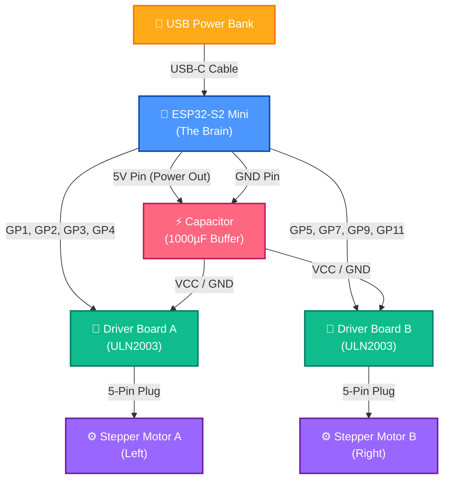

# 🤖 ESP32-S2 Mini Robo-Control Dashboard

Welcome to the **Robo-Control Dashboard**! This is a fun, visual way to build and program your own robot using an **ESP32-S2 Mini** board and stepper motors. 

The robot acts as its own Wi-Fi hotspot. When you connect your phone, tablet, or computer to it, a modern dashboard pops up automatically—no internet needed!

---

## 🎨 The Three Awesome Modes

The dashboard splits the robot control into three visual modes. Tap the tabs at the top of the screen to switch between them:

### 🧩 1. Coding Mode (Workflow Creator)
This is your coding workspace! Click block buttons on the left to add command blocks. Drag them around to change their order, choose which motors to run, adjust speeds, and add wait times. 

**New Senses & Blocks:**
*   **Set Motor Speed:** Adjust the speed delay of any motor on-the-fly.
*   **Stop Motors:** Instantly freeze all robot movement.
*   **If Vision tracks target:** Run blocks only if the camera sees your marker in a certain area (Left, Center, Right).
*   **If Sound hears clap:** Run blocks only when the phone microphone detects a loud clap!

---

### 🕹️ 2. Manual Drive Mode (Steering Joysticks)
Drive your robot directly using virtual vertical joysticks! Slide them up to drive forward, slide them down to drive backward, and release them to stop. The dashboard automatically builds a joystick for every motor you connect.

---

### 🧠 3. AI Explorer Mode (Self-Learning)
In this mode, you place your phone on a stand looking down at the robot. 
1.  **Scan the Robot:** Click **Start Training** and tap your robot's colored sticker on the screen to lock the target.
2.  **Babbling Phase:** The robot automatically wiggles its motors back and forth. The camera watches how each wiggle moves the robot on screen.
3.  **Autonomous Autopilot:** A neural network calculates how the robot moves. Click **Start Autopilot** and watch the robot navigate to follow targets!

---

## 🔌 How to Wire Your Robot

Here is a nice, color-coded map showing how all the parts plug together. 

### ⚠️ A Rule for the Power Buffer (Capacitor)
Motors consume a lot of electricity in quick pulses. This can cause the ESP32 brain to reset (restart). 
*   **The Fix:** You must connect a **1000uF Electrolytic Capacitor** across the 5V and GND rails.
*   *⚠️ Crucial:* The capacitor is polarized! Solder the **longer lead (+)** to the 5V power line and the **lead with the white stripe (-)** to the GND line.

---

## 🛠️ Step-by-Step Build Guide

1.  **Mount the Motors:** Screw two **28BYJ-48 stepper motors** into your 3D-printed chassis (any standard dual-stepper rover frame from Printables/Thingiverse). Press the wheels onto the shafts.
2.  **Solder the Power Rails:** Build a shared 5V line and GND line on a solderable perfboard. Solder the capacitor across them (mind the positive/negative directions!).
3.  **Connect the Brain & Drivers:** Connect the ESP32-S2's **5V** and **GND** pins to the power rails. Connect the power pins of the ULN2003 drivers to the same rails.
4.  **Control Wires:** Connect driver inputs to ESP32 pins:
    *   Left Motor A: GPIO **1, 2, 3, 4**
    *   Right Motor B: GPIO **5, 7, 9, 11**
5.  **Plug in Motors:** Plug the stepper motor cables directly into their driver boards.

---

## 🔌 Connecting Extra Senses (Sensors)

You can easily expand your robot's senses by connecting other hardware sensors to the ESP32-S2 Mini!

### Example: Ultrasonic Range Finder (HC-SR04)
This sensor acts like a bat's sonar, letting the robot measure distances to walls or obstacles.

#### 1. Wiring it to the Brain:
*   **VCC:** Connect to the 5V Rail
*   **GND:** Connect to the GND Rail
*   **Trig (Trigger):** Connect to GP12
*   **Echo:** Connect to GP13

#### 2. Using it in all Modes:
*   **🧩 Coding Mode:** You can add an `If Sensor [distance] < 15cm then [Stop Motors]` block! You can edit the MicroPython interpreter `main.py` to read pins GP12/GP13 using Python's `time` library to calculate pulse durations.
*   **🕹️ Manual Mode:** Read the ultrasonic values in the background and display the real-time distance directly inside the **Status Monitors** panel!
*   **🧠 AI Explorer:** The robot can use the sensor as a physical backup to trigger collision escapes if it runs into a chair leg that the phone camera cannot see.

---

## 🚀 Run the Code

1.  Install flashing tools on your computer: `make install-tools`
2.  Upload all files to the ESP32: `make upload`
3.  Reset the board to start: `make reset`
4.  Connect your phone's Wi-Fi to the network **"Robo-Control"**, open `http://robot.com` and start coding!
