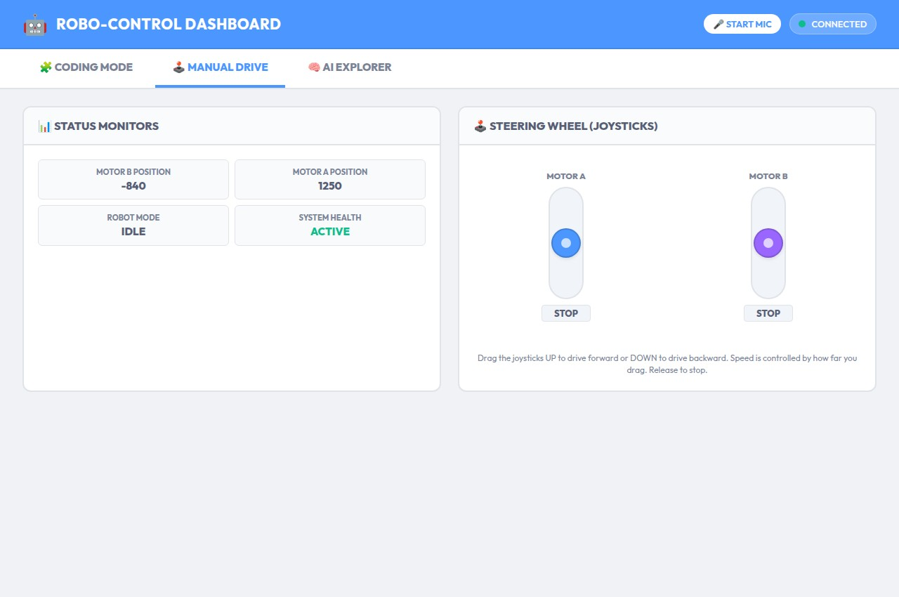
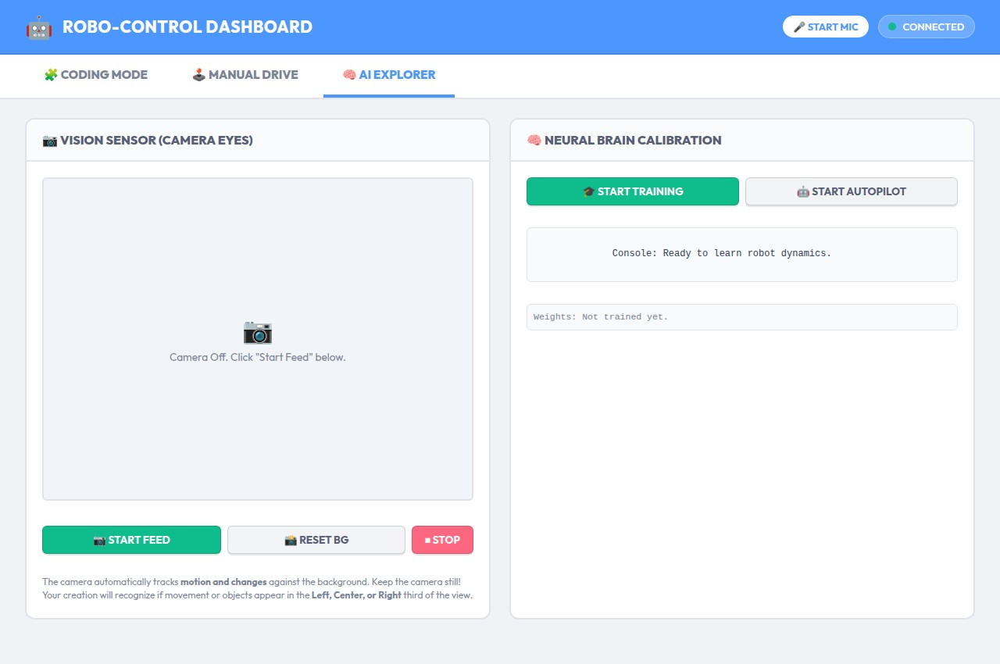
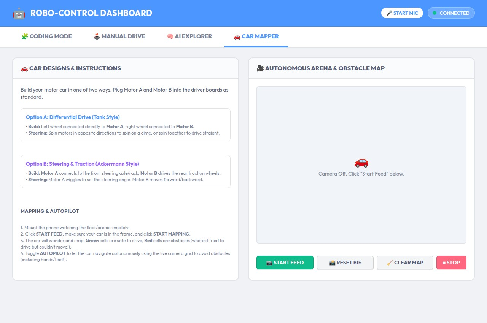
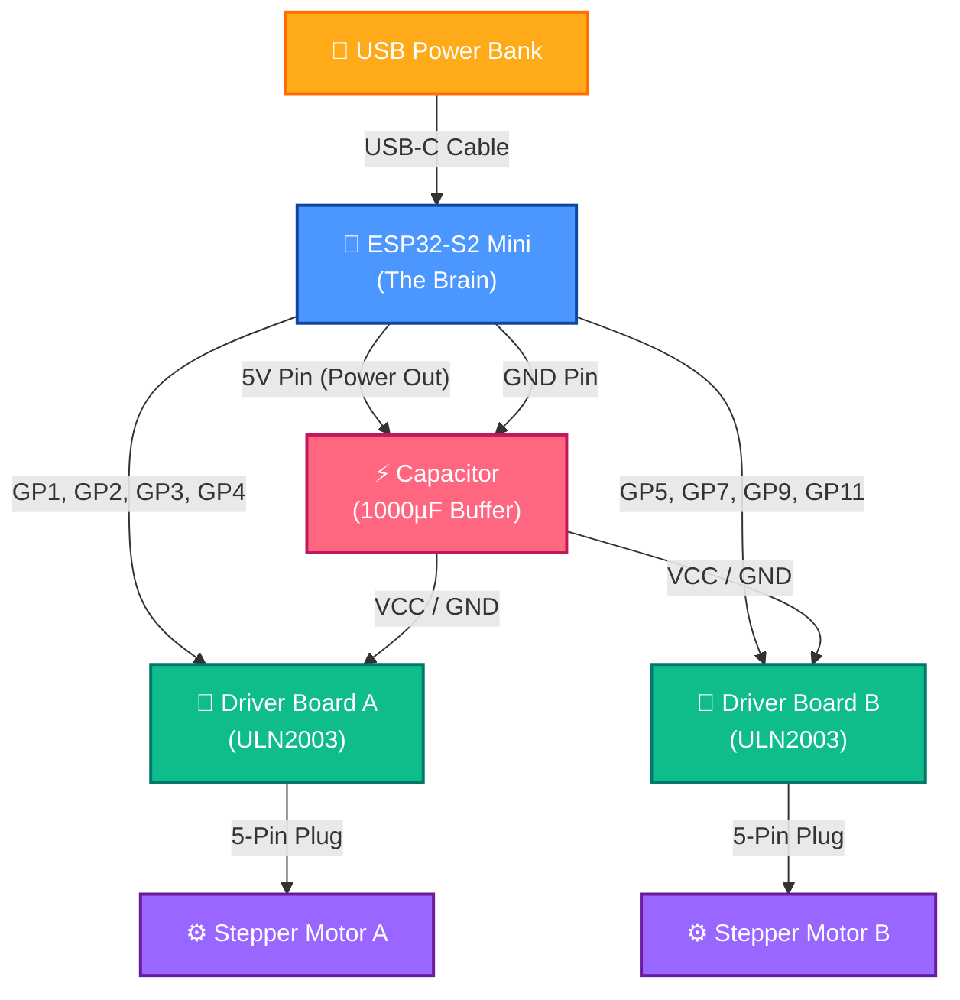
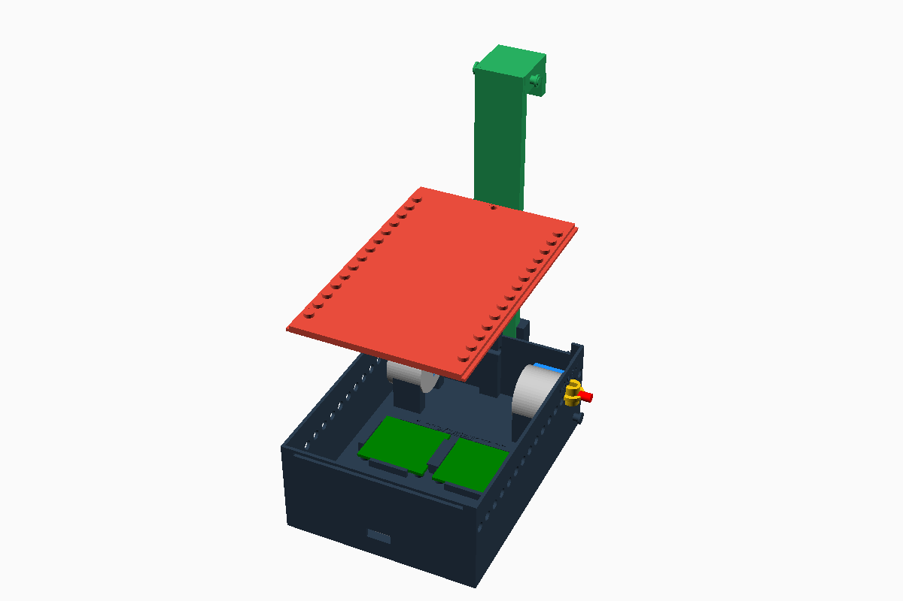

# 🤖 ESP32-S2 Mini Kinetic Builder Dashboard

Welcome to the **Kinetic Builder Dashboard**! This is a fun, visual way to build and program **anything you can imagine** using an **ESP32-S2 Mini** brain and motorized stepper muscles. 

It doesn't have to be a standard robot—you can build a **crane**, a **car**, a **catapult**, a **drawing machine**, a **conveyor belt**, or a **robotic arm**! As long as it uses the motors and sensors, you can bring it to life.

**[🌐 View the Live Dashboard Demo on GitHub Pages](https://sloev.github.io/robo/)** *(Note: Hardware connections are simulated in the web demo).*

The brain board acts as its own Wi-Fi hotspot. When you connect your phone, tablet, or computer to it, this modern dashboard pops up automatically—no internet needed!

---

## 🎨 The Three Awesome Modes

The dashboard splits the control into three visual modes. Tap the tabs at the top of the screen to switch between them:

### 🧩 1. Coding Mode (Workflow Creator)
This is your coding workspace! Click block buttons on the left to add command blocks. Drag them around to change their order, choose which motors to run, adjust speeds, and add wait times. 

**Senses & Command Blocks:**
*   **Set Motor Speed:** Adjust the speed delay of any motor on-the-fly.
*   **Stop Motors:** Instantly freeze all movement.
*   **If Vision tracks target:** Run blocks only if the camera sees your tracking marker in a certain area (Left, Center, Right).
*   **If Sound hears clap:** Run blocks only when the phone microphone detects a loud clap!

---

### 🕹️ 2. Manual Drive Mode (Steering Joysticks)
Drive your creation directly using virtual vertical joysticks! Slide them up or down to rotate cogs, move joints, or drive wheels, and release them to stop. The dashboard automatically builds a joystick for every motor you connect.

---

### 🧠 3. AI Explorer Mode (Kinematic Discovery)
This is where the magic happens! Your creation doesn't need to know what it is. In this mode, the phone watches the creation from a stand and **helps it discover its own body** (whether it's a crane, a car, or a catapult).

1.  **Background Calibration:** Click **Start Training**. The dashboard automatically captures the static background scene. Keep the camera completely still and hands out of the frame!
2.  **Kinematic Babbling:** The creation automatically wiggles its motors. Using magic background differencing, the camera detects how each wiggle moves the creation's body parts in real time.
3.  **Self-Discovery:** 
    *   *"Oh, I am a crane! Turning Motor A lifts my arm up!"*
    *   *"Oh, I am a car! Turning Motor A drives me forward, and Motor B steers me!"*
    *   *"Oh, I am a catapult! Motor A winds up my spring cog!"*
4.  **Autonomous Autopilot:** Click **Start Autopilot** and watch your creation navigate its parts. If you wave a hand or move objects, it will track the movement and move its own body to follow it!

---

### 🚗 4. Car Mapper Mode (Autonomous Mapping & Avoidance)
Turn your stepper motor creation into an autonomous self-driving car! This mode explains how to build a car (either dual-motor **Differential Drive** or single-motor **Ackermann Steering & Traction**) and maps the room using the camera!

1.  **Car Selection & Design:** Follow the on-screen templates to assemble wheels and steering axles.
2.  **Autonomous Arena Mapping:** Place the car in the room and turn on the camera. As the car wanders around, it dynamically creates a 2D map overlay on top of the live video feed.
    *   **Green Cells:** Safe paths where the car successfully drove.
    *   **Red Cells:** Obstacles (where the car wiggled its wheels but was physically blocked from moving forward).
3.  **Collision Avoidance Autopilot:** Turn on Autopilot, and the car will navigate itself around the room avoiding the mapped Red obstacles. Waving a hand or foot in front of it is instantly detected as a moving obstacle, and the car will steer away in real time!

---

## 🔌 How to Wire Your Creation

Here is a nice, color-coded map showing how all the parts plug together. 

### ⚠️ A Rule for the Power Buffer (Capacitor)
Motors consume a lot of electricity in quick pulses. This can cause the ESP32 brain to reset (restart). 
*   **The Fix:** You must connect a **1000uF Electrolytic Capacitor** across the 5V and GND rails.
*   *⚠️ Crucial:* The capacitor is polarized! Solder the **longer lead (+)** to the 5V power line and the **lead with the white stripe (-)** to the GND line.

---

### ⚡ The "Minimum Version" (No Protoboard, No Capacitor!)
If you want to build the absolute simplest version of this project, you don't even need the capacitor or a protoboard! You can wire the components directly together:
1. Solder standard dupont jumper wires directly from the ESP32-S2's `5V` and `GND` pins to the `+` and `-` power pins on **both** ULN2003 driver boards.
2. Wire the control pins directly (GP1-4 to Driver A, GP5-11 to Driver B).
3. Plug in the Steppers.
4. Power the ESP32-S2 directly using a **USB Power Bank**. 
*Note: Because you don't have a smoothing capacitor, running both motors at maximum speed simultaneously might occasionally cause the ESP32 to brown-out and reset, but it works perfectly for most simple builds and learning!*

---

## 🏎️ The Custom 3D Printed Chassis

Check out our fully integrated Lego-compatible chassis design. The CI automatically renders this from our parametric OpenSCAD source directly into Slicer-ready assets and generates the screenshot below!

**Download the latest auto-generated 3D Models:**
* [⬇️ Chassis Base (.obj)](https://github.com/sloev/robo/raw/master/vehicle_base.obj)
* [⬇️ Sliding Lid (.obj)](https://github.com/sloev/robo/raw/master/vehicle_lid.obj)
* [⬇️ Captive Couplers (.obj)](https://github.com/sloev/robo/raw/master/vehicle_couplers.obj)

---

## 🛠️ Step-by-Step Build Guide

1.  **Mount the Motors:** Screw your **28BYJ-48 stepper motors** into your custom cardboard, wood, or 3D-printed creation (e.g. wheels for a car, a pulley spool for a crane, or a launching arm for a catapult).
2.  **Solder the Power Rails:** Build a shared 5V line and GND line on a solderable perfboard. Solder the capacitor across them (mind the positive/negative directions!).
3.  **Connect the Brain & Drivers:** Connect the ESP32-S2's **5V** and **GND** pins to the power rails. Connect the power pins of the ULN2003 drivers to the same rails.
4.  **Control Wires:** Connect driver inputs to ESP32 pins:
    *   Motor A: GPIO **1, 2, 3, 4**
    *   Motor B: GPIO **5, 7, 9, 11**
5.  **Plug in Motors:** Plug the stepper motor cables directly into their driver boards.

---

## 🔌 Connecting Extra Senses (Sensors & Switches)

You can easily expand your creation's senses by connecting buttons, switches, dials, and other simple sensors directly to the ESP32-S2 Mini. The system has built-in support for digital and analog inputs!

### 🔘 1. Buttons & Switches (Digital Sensors)
You can connect buttons or toggle/micro-switches to **GPIO 12 (Button A)** and **GPIO 13 (Button B)**.
*   **Wiring:** Connect one leg of the button/switch to the GPIO pin (GP12 or GP13) and the other leg to **GND**.
*   **How it works:** The board uses internal pull-up resistors, keeping the signal `HIGH` (released) by default. When pressed/toggled, it connects to GND, pulling the signal `LOW` (pressed).
*   **Coding Mode:** Use the `If Button [A/B] is [Pressed/Released]` blocks to create conditional behaviors (e.g., *"If Button A is Pressed, then Move Motor A by 500 steps"*).

### 🎛️ 2. Dials & Potentiometers (Analog Sensors)
Connect an analog dial (potentiometer, e.g., 10kΩ) to **GPIO 14** to adjust speeds, thresholds, or angles.
*   **Wiring:** 
    *   Connect the **left pin** to **GND**.
    *   Connect the **right pin** to the ESP32's **3.3V pin** (do NOT use 5V for analog signals!).
    *   Connect the **middle pin (wiper)** to **GPIO 14**.
*   **How it works:** Turning the dial changes the voltage from 0V to 3.3V. The brain's Analog-to-Digital Converter (ADC) reads this and scales it from `0%` to `100%`.
*   **Coding Mode:** Use the `If Dial is [Greater than / Less than / Equal to] [X]%` block to trigger movements at specific dial positions (e.g., *"If Dial is Greater than 80%, then Stop Motors"*).

### 🍎 3. More Low-Hanging Fruits (Easy Upgrades)
Because the inputs are standard digital and analog pins, you can connect many other cheap sensors:
*   **Infrared Line/Obstacle Sensors (TCRT5000):** These have a digital output that behaves exactly like a button. Connect their `OUT` pin to **GP12** or **GP13**. When they detect a line or object, they pull the signal low—triggering your `If Button is Pressed` block!
*   **Light Sensors (LDR Photoresistors):** Build a simple voltage divider with a photoresistor and a 10k resistor. Connect the output to **GP14**. The light level will show up on your dashboard as the **Dial** percentage, letting you code light-sensitive creations (e.g., *"If Dial is Less than 30% [it's dark], then Move Motor A"*).
*   **Limit/Micro-Switches:** Wire these to GP12/GP13 just like buttons. Perfect for creating a crane that automatically stops winding when the carriage hits a physical limit switch!

---

## 🚀 Run the Code

1.  Install flashing tools on your computer: `make install-tools`
2.  Upload all files to the ESP32: `make upload`
3.  Reset the board to start: `make reset`
4.  Connect your phone's Wi-Fi to the network **"Robo-Control"**, open `http://robot.com` and start creating!
